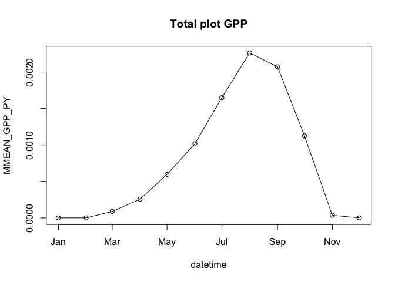
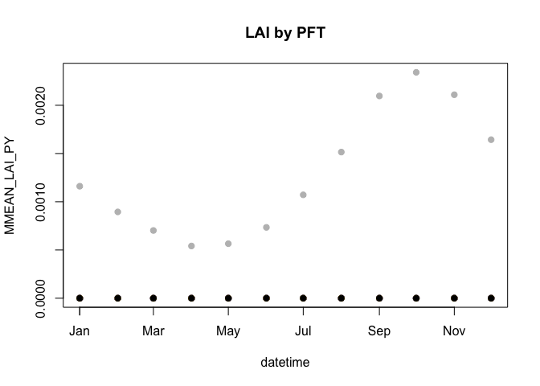

ED 2.2 R interface
================
Alexey Shikloamnov

# Prepare inputs

For this tutorial, in your working directory, create a folder called
`ed-input-data`.

Download meteorology inputs from the [GitHub releases
page](https://github.com/FoRTExperiment/ed4forte/releases/tag/met-ed2).
For this tutorial, use the `NARR-ED2.tar.gz` file (North American
Regional Reanalysis). Download the file into `ed-input-data` and extract
it.

``` sh
cd ed-input-data
tar -xf NARR-ED2.tar.gz
cd ..
```

You should now have a directory `ed-input-data/NARR-ED2` containing a
bunch of files like `1979JAN.h5` as well as a file called
`ED_MET_DRIVER_HEADER`.

Open the `ed-input-data/NARR-ED2/ED_MET_DRIVER_HEADER` file in a text
editor, and change the third line (`/Users/shik544/...`) so it matches
the path of the directory
(e.g. `/path/to/current/directory/ed-input-data/NARR-ED2/`). You can
also do this with the following shell command:

``` sh
# Use `gsed` instead of `sed` if on MacOS
sed -i "3s:.*:$PWD/ed-input-data/NARR-ED2/:" ed-input-data/NARR-ED2/ED_MET_DRIVER_DATA
```

The remaining inputs required for a basic ED2 simulation ship with the
`ed4forte` package. Install the package from your local clone
(`devtools::install("/path/to/ed4forte")`) or from GitHub
(`devtools::install_github("FoRTExperiment/ed4forte")`).

# Basic ED2 run

First, locate the ED2 executable and set the R option `ed4forte.ed2_exe`
to the absolute path to this executable.

``` r
options(ed4forte.ed2_exe = "/path/to/ED/build/ed_2.2-dbg")
```

Use the following R code to perform a simple ED2 simulation at UMBS for
the year 2000 starting from bare ground:

``` r
library(ed4forte)

outdir <- "test-ed-outputs"
ed_input_dir <- "ed-input-data" 
assertthat::assert_that(dir.exists("ed-input-data"))

p <- run_ed2(
  outdir,
  "2000-01-01",
  "2001-01-01",
  ED_MET_DRIVER_DB = file.path(ed_input_dir, "NARR-ED2", "ED_MET_DRIVER_HEADER")
)
```

The first argument to `run_ed2` is the output directory (which will be
created if it doesn’t exist). The next two arguments are the start and
end date (-times), respectively. The last argument indicates that the
default ED2IN value of the `ED_MET_DRIVER_DB` tag should be modified to
that value. Any default values for ED2IN tags can be modified in this
way.

Note that the code above will return immediately. This is because it
triggers ED2 to run in the background. The return object (`p`) is a
[`processx`](https://processx.r-lib.org/index.html) process, which can
be examined.

``` r
p$get_status()
```

    ## [1] "running"

``` r
p$is_alive()
```

    ## [1] TRUE

For more details, see the [`processx::process`
documentation](https://processx.r-lib.org/reference/process.html). To
wait for the run to complete, use the `wait()` method.

``` r
p$wait()
```

You can tell that the run finished by examining the contents of the
output directory.

``` r
list.files(outdir)
```

    ##  [1] "analysis-E-2000-01-00-000000-g01.h5" "analysis-E-2000-02-00-000000-g01.h5"
    ##  [3] "analysis-E-2000-03-00-000000-g01.h5" "analysis-E-2000-04-00-000000-g01.h5"
    ##  [5] "analysis-E-2000-05-00-000000-g01.h5" "analysis-E-2000-06-00-000000-g01.h5"
    ##  [7] "analysis-E-2000-07-00-000000-g01.h5" "analysis-E-2000-08-00-000000-g01.h5"
    ##  [9] "analysis-E-2000-09-00-000000-g01.h5" "analysis-E-2000-10-00-000000-g01.h5"
    ## [11] "analysis-E-2000-11-00-000000-g01.h5" "analysis-E-2000-12-00-000000-g01.h5"
    ## [13] "ED2IN"                               "stderr.log"                         
    ## [15] "stdout.log"

You should see the 12 monthly output files, along with a copy of the
ED2IN file used for the run and two log files corresponding to the input
(`stdout`) and error (`stderr`) streams.

# Reading output

ED2 outputs are in HDF5 format, of which NetCDF is a special case.
Therefore, they can be read by NetCDF utilities, like the `ncdf4`
package.

``` r
outfiles <- list.files(outdir, "analysis-E-", full.names = TRUE)
nc <- ncdf4::nc_open(outfiles[1])
ncdf4::ncvar_get(nc, "AGB_CO")
```

    ## [1] 0.0002973947 0.0002414269 0.0001701059 0.0001030530 0.0001030530

``` r
ncdf4::ncvar_get(nc, "MMEAN_GPP_PY")
```

    ## [1] 0

Unfortunately, ED2’s produces only one file per timestep, which makes
reading in results from long simulations pain. `ed4forte` provides some
utilities for reading a subset of ED2 file types and variables in bulk.

``` r
results <- read_monthly_dir(outdir)
```

    ## Reading all HDF5 files

``` r
results
```

    ## # A tibble: 1 x 6
    ##   basename     df_scalar      df_cohort     df_soil      df_pft       outdir    
    ##   <chr>        <list>         <list>        <list>       <list>       <chr>     
    ## 1 test-ed-out… <tibble [12 ×… <tibble [65 … <tibble [84… <tibble [20… test-ed-o…

``` r
scalar_results <- tidyr::unnest(results, df_scalar)
scalar_results
```

    ## # A tibble: 12 x 353
    ##    basename datetime            PYSI_ID PYSI_N  XATM  YATM LONGITUDE LATITUDE
    ##    <chr>    <dttm>                <int>  <int> <int> <int>     <dbl>    <dbl>
    ##  1 test-ed… 2000-01-01 00:00:00       1      1     1     1     -84.7     45.6
    ##  2 test-ed… 2000-02-01 00:00:00       1      1     1     1     -84.7     45.6
    ##  3 test-ed… 2000-03-01 00:00:00       1      1     1     1     -84.7     45.6
    ##  4 test-ed… 2000-04-01 00:00:00       1      1     1     1     -84.7     45.6
    ##  5 test-ed… 2000-05-01 00:00:00       1      1     1     1     -84.7     45.6
    ##  6 test-ed… 2000-06-01 00:00:00       1      1     1     1     -84.7     45.6
    ##  7 test-ed… 2000-07-01 00:00:00       1      1     1     1     -84.7     45.6
    ##  8 test-ed… 2000-08-01 00:00:00       1      1     1     1     -84.7     45.6
    ##  9 test-ed… 2000-09-01 00:00:00       1      1     1     1     -84.7     45.6
    ## 10 test-ed… 2000-10-01 00:00:00       1      1     1     1     -84.7     45.6
    ## 11 test-ed… 2000-11-01 00:00:00       1      1     1     1     -84.7     45.6
    ## 12 test-ed… 2000-12-01 00:00:00       1      1     1     1     -84.7     45.6
    ## # … with 345 more variables: CROP_HARVEST_PY <dbl>, LOGGING_HARVEST_PY <dbl>,
    ## #   COMBUSTED_FUEL_PY <dbl>, MMEAN_GPP_PY <dbl>, MMEAN_NPP_PY <dbl>,
    ## #   MMEAN_LEAF_RESP_PY <dbl>, MMEAN_ROOT_RESP_PY <dbl>,
    ## #   MMEAN_LEAF_GROWTH_RESP_PY <dbl>, MMEAN_ROOT_GROWTH_RESP_PY <dbl>,
    ## #   MMEAN_SAPA_GROWTH_RESP_PY <dbl>, MMEAN_SAPB_GROWTH_RESP_PY <dbl>,
    ## #   MMEAN_BARKA_GROWTH_RESP_PY <dbl>, MMEAN_BARKB_GROWTH_RESP_PY <dbl>,
    ## #   MMEAN_LEAF_STORAGE_RESP_PY <dbl>, MMEAN_ROOT_STORAGE_RESP_PY <dbl>,
    ## #   MMEAN_SAPA_STORAGE_RESP_PY <dbl>, MMEAN_SAPB_STORAGE_RESP_PY <dbl>,
    ## #   MMEAN_BARKA_STORAGE_RESP_PY <dbl>, MMEAN_BARKB_STORAGE_RESP_PY <dbl>,
    ## #   MMEAN_PLRESP_PY <dbl>, MMEAN_LEAF_ENERGY_PY <dbl>,
    ## #   MMEAN_LEAF_WATER_PY <dbl>, MMEAN_LEAF_WATER_IM2_PY <dbl>,
    ## #   MMEAN_LEAF_HCAP_PY <dbl>, MMEAN_LEAF_VPDEF_PY <dbl>,
    ## #   MMEAN_LEAF_TEMP_PY <dbl>, MMEAN_LEAF_FLIQ_PY <dbl>,
    ## #   MMEAN_LEAF_GSW_PY <dbl>, MMEAN_LEAF_GBW_PY <dbl>,
    ## #   MMEAN_WOOD_ENERGY_PY <dbl>, MMEAN_WOOD_WATER_PY <dbl>,
    ## #   MMEAN_WOOD_WATER_IM2_PY <dbl>, MMEAN_WOOD_HCAP_PY <dbl>,
    ## #   MMEAN_WOOD_TEMP_PY <dbl>, MMEAN_WOOD_FLIQ_PY <dbl>,
    ## #   MMEAN_WOOD_GBW_PY <dbl>, MMEAN_FS_OPEN_PY <dbl>, MMEAN_FSW_PY <dbl>,
    ## #   MMEAN_FSN_PY <dbl>, MMEAN_A_OPEN_PY <dbl>, MMEAN_A_CLOSED_PY <dbl>,
    ## #   MMEAN_A_NET_PY <dbl>, MMEAN_A_LIGHT_PY <dbl>, MMEAN_A_RUBP_PY <dbl>,
    ## #   MMEAN_A_CO2_PY <dbl>, MMEAN_PSI_OPEN_PY <dbl>, MMEAN_PSI_CLOSED_PY <dbl>,
    ## #   MMEAN_WATER_SUPPLY_PY <dbl>, MMEAN_PAR_L_PY <dbl>,
    ## #   MMEAN_PAR_L_BEAM_PY <dbl>, MMEAN_PAR_L_DIFF_PY <dbl>,
    ## #   MMEAN_RSHORT_L_PY <dbl>, MMEAN_RLONG_L_PY <dbl>,
    ## #   MMEAN_SENSIBLE_LC_PY <dbl>, MMEAN_VAPOR_LC_PY <dbl>, MMEAN_TRANSP_PY <dbl>,
    ## #   MMEAN_WFLUX_WL_PY <dbl>, MMEAN_WFLUX_GW_PY <dbl>,
    ## #   MMEAN_INTERCEPTED_AL_PY <dbl>, MMEAN_WSHED_LG_PY <dbl>,
    ## #   MMEAN_RSHORT_W_PY <dbl>, MMEAN_RLONG_W_PY <dbl>,
    ## #   MMEAN_SENSIBLE_WC_PY <dbl>, MMEAN_VAPOR_WC_PY <dbl>,
    ## #   MMEAN_INTERCEPTED_AW_PY <dbl>, MMEAN_WSHED_WG_PY <dbl>, MMEAN_RH_PY <dbl>,
    ## #   MMEAN_FGC_RH_PY <dbl>, MMEAN_FSC_RH_PY <dbl>, MMEAN_STGC_RH_PY <dbl>,
    ## #   MMEAN_STSC_RH_PY <dbl>, MMEAN_MSC_RH_PY <dbl>, MMEAN_SSC_RH_PY <dbl>,
    ## #   MMEAN_PSC_RH_PY <dbl>, MMEAN_NEP_PY <dbl>, MMEAN_RK4STEP_PY <dbl>,
    ## #   MMEAN_AVAILABLE_WATER_PY <dbl>, MMEAN_VEG_DISPLACE_PY <dbl>,
    ## #   MMEAN_ROUGH_PY <dbl>, MMEAN_CAN_THEIV_PY <dbl>, MMEAN_CAN_THETA_PY <dbl>,
    ## #   MMEAN_CAN_VPDEF_PY <dbl>, MMEAN_CAN_TEMP_PY <dbl>, MMEAN_CAN_SHV_PY <dbl>,
    ## #   MMEAN_CAN_CO2_PY <dbl>, MMEAN_CAN_RHOS_PY <dbl>, MMEAN_CAN_DMOL_PY <dbl>,
    ## #   MMEAN_CAN_PRSS_PY <dbl>, MMEAN_GND_TEMP_PY <dbl>, MMEAN_GND_SHV_PY <dbl>,
    ## #   MMEAN_CAN_GGND_PY <dbl>, MMEAN_SFCW_DEPTH_PY <dbl>,
    ## #   MMEAN_SFCW_ENERGY_PY <dbl>, MMEAN_SFCW_MASS_PY <dbl>,
    ## #   MMEAN_SFCW_TEMP_PY <dbl>, MMEAN_SFCW_FLIQ_PY <dbl>,
    ## #   MMEAN_RSHORT_GND_PY <dbl>, MMEAN_PAR_GND_PY <dbl>,
    ## #   MMEAN_RLONG_GND_PY <dbl>, MMEAN_RLONGUP_PY <dbl>, …

``` r
plot(MMEAN_GPP_PY ~ datetime, data = scalar_results, type = "o",
     main = "Total plot GPP")
```

<!-- -->

``` r
pft_results <- tidyr::unnest(results, df_pft)
pft_results
```

    ## # A tibble: 204 x 43
    ##    basename df_scalar df_cohort df_soil datetime              pft NPLANT_PY
    ##    <chr>    <list>    <list>    <list>  <dttm>              <int>     <dbl>
    ##  1 test-ed… <tibble … <tibble … <tibbl… 2000-01-01 00:00:00     1    0.0771
    ##  2 test-ed… <tibble … <tibble … <tibbl… 2000-01-01 00:00:00     2    0.0771
    ##  3 test-ed… <tibble … <tibble … <tibbl… 2000-01-01 00:00:00     3    0.0773
    ##  4 test-ed… <tibble … <tibble … <tibbl… 2000-01-01 00:00:00     4    0.0775
    ##  5 test-ed… <tibble … <tibble … <tibbl… 2000-01-01 00:00:00     5    0     
    ##  6 test-ed… <tibble … <tibble … <tibbl… 2000-01-01 00:00:00     6    0     
    ##  7 test-ed… <tibble … <tibble … <tibbl… 2000-01-01 00:00:00     7    0     
    ##  8 test-ed… <tibble … <tibble … <tibbl… 2000-01-01 00:00:00     8    0     
    ##  9 test-ed… <tibble … <tibble … <tibbl… 2000-01-01 00:00:00     9    0     
    ## 10 test-ed… <tibble … <tibble … <tibbl… 2000-01-01 00:00:00    10    0     
    ## # … with 194 more rows, and 36 more variables: AGB_PY <dbl>, WAI_PY <dbl>,
    ## #   BASAL_AREA_PY <dbl>, BDEADA_PY <dbl>, BDEADB_PY <dbl>, BTIMBER_PY <dbl>,
    ## #   BSAPWOODA_PY <dbl>, BSAPWOODB_PY <dbl>, BSEEDS_PY <dbl>, BYIELD_PY <dbl>,
    ## #   BDEADA_N_PY <dbl>, BDEADB_N_PY <dbl>, BSAPWOODA_N_PY <dbl>,
    ## #   BSAPWOODB_N_PY <dbl>, BSEEDS_N_PY <dbl>, MMEAN_THBARK_PY <dbl>,
    ## #   MMEAN_LAI_PY <dbl>, MMEAN_BLEAF_PY <dbl>, MMEAN_BROOT_PY <dbl>,
    ## #   MMEAN_BBARKA_PY <dbl>, MMEAN_BBARKB_PY <dbl>, MMEAN_BALIVE_PY <dbl>,
    ## #   MMEAN_BSTORAGE_PY <dbl>, MMEAN_BLEAF_N_PY <dbl>, MMEAN_BROOT_N_PY <dbl>,
    ## #   MMEAN_BBARKA_N_PY <dbl>, MMEAN_BBARKB_N_PY <dbl>, MMEAN_BALIVE_N_PY <dbl>,
    ## #   MMEAN_BSTORAGE_N_PY <dbl>, MMEAN_LEAF_MAINTENANCE_PY <dbl>,
    ## #   MMEAN_ROOT_MAINTENANCE_PY <dbl>, MMEAN_BARKA_MAINTENANCE_PY <dbl>,
    ## #   MMEAN_BARKB_MAINTENANCE_PY <dbl>, MMEAN_LEAF_DROP_PY <dbl>,
    ## #   MMEAN_ROOT_DROP_PY <dbl>, outdir <chr>

``` r
plot(MMEAN_LAI_PY ~ datetime, data = pft_results, col = pft, pch = 19,
     main = "LAI by PFT")
```

<!-- -->
